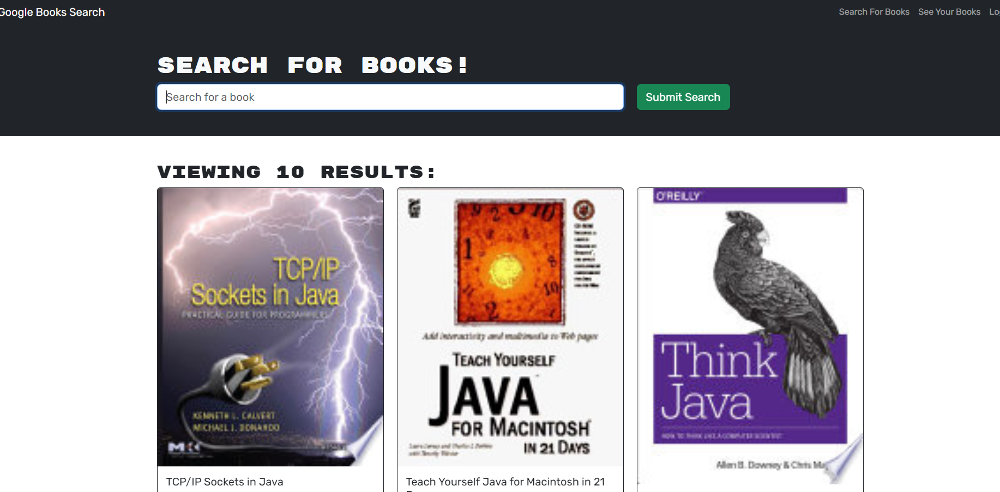

# Project Title
MyBookSearchEngine

 

## Description 🔎
The MyBookSearchEngine is a web application that allows users to search for books using the Google Books API and save their favorite books to a personalized list. The application is built with the MERN stack (MongoDB, Express, React, Node.js) and uses Apollo Server to handle GraphQL queries and mutations for fetching and modifying data.

## Table of Contents 📖
- [Installation](#installation-⚙️)
- [License](#license-MIT)
- [Deployed Application](#deployed-application-🚀)
- [Screenshots](#Screenshots)
- [Contibuters](#Contributors-🧑‍🤝‍🧑)

## Installation ⚙️
To run the application locally, follow these steps:
1. clone the repository from https://github.com/mojo718/MyBookSearchEngine
2. Install Dependencies by running 'npm install'
3. Enter 'npm run Develop' to concurrently start Server and Client

## License
      This application is covered by the MIT license.

## Deployed Application
https://mybooksearchengine.onrender.com

## Screenshots

## Contributors 🧑‍🤝‍🧑
Ben Montijo

## Questions 🙋
If there are any questions, feel free to contact my email at: mojo718@yahoo.com

You can also find me on GitHub at:  https://github.com/mojo718
